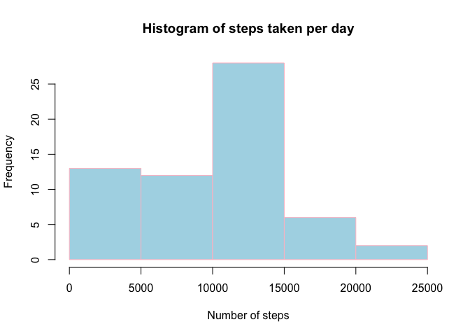
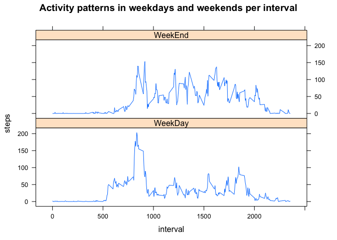

# Reproducible Research: Peer Assessment 1
########################################################################################

## Loading and preprocessing the data,loading packages


```r
act_data<-read.csv("data/activity.csv")
library("dplyr")
```

```
## 
## Attaching package: 'dplyr'
## 
## The following object is masked from 'package:stats':
## 
##     filter
## 
## The following objects are masked from 'package:base':
## 
##     intersect, setdiff, setequal, union
```

```r
library("timeDate")
```

```
## Warning: package 'timeDate' was built under R version 3.1.2
```

```r
library("lattice")
```

## What is mean total number of steps taken per day?


```r
#Summarise data by date
act_data_bydate<-group_by(act_data,date)
act_data_summary<-summarise(act_data_bydate,sum(steps,na.rm=TRUE))
names(act_data_summary)[2]<-"steps"
#Create a plot
hist(act_data_summary$steps,col = "lightblue", border = "pink",main="Histogram of steps taken per day",xlab="Number of steps",ylab="Frequency")
```

 

```r
mean_steps<-mean(act_data_summary$steps,na.rm=TRUE)
median_steps<-median(act_data_summary$steps,na.rm=TRUE)
```

The mean steps per day is 9354.2295 and the median steps per day is 10395

## What is the average daily activity pattern?


```r
#Summarise Data by Interval
act_data_byinterval<-group_by(act_data,interval)
act_data_summary<-summarise(act_data_byinterval,mean(steps,na.rm=TRUE))
names(act_data_summary)[2]<-"steps"
#Plot the Average Daily Activity pattern
plot(act_data_summary$interval,act_data_summary$steps,type="l",main="Average daily activity pattern",xlab="Interval",ylab="Steps")
```

 

```r
#Calculate the interval with maximum steps
max_interval<-act_data_summary$interval[act_data_summary$steps==max(act_data_summary$steps)]
```

The interval with maximum steps per day is 835

## Inputing missing values


```r
head(act_data)
```

```
##   steps       date interval
## 1    NA 2012-10-01        0
## 2    NA 2012-10-01        5
## 3    NA 2012-10-01       10
## 4    NA 2012-10-01       15
## 5    NA 2012-10-01       20
## 6    NA 2012-10-01       25
```

```r
num_steps_NA <- length(which(is.na(act_data$steps)))
```

The number of steps with Na values is 2304


```r
#Group Data by date
act_data_bydate<-group_by(act_data,date)
act_data_summary<-summarise(act_data_bydate,mean(steps,na.rm=TRUE))
names(act_data_summary)[2]<-"steps"
#Replace values with NaN
act_data_summary$steps[is.nan(act_data_summary$steps)]<-0
#Create a clean dataset
act_data_clean<-act_data
for(i in 1:length(act_data_clean$steps)){
    if(is.na(act_data_clean$steps[i]))
        {act_data_clean$steps[i]<-act_data_summary$steps[act_data_summary$date %in% act_data_clean$date[i]]
             }
}
#Group by date
act_data_clean_bydate<-group_by(act_data_clean,date)
act_data_clean_summary<-summarise(act_data_clean_bydate,sum(steps,na.rm=TRUE))
names(act_data_clean_summary)[2]<-"steps"
#Plot the histogram of number of steps
hist(act_data_clean_summary$steps,col = "lightblue", border = "pink",main="Histogram of steps taken per day",xlab="Number of steps",ylab="Frequency")
```

 

```r
mean_steps<-mean(act_data_clean_summary$steps,na.rm=TRUE)
median_steps<-median(act_data_clean_summary$steps,na.rm=TRUE)
```

The mean steps per day is 9354.2295 and the median steps per day is 1.0395 &times; 10<sup>4</sup>

**We observe that the estimates do not differ much from the first part of the Assignment because we took the mean steps in case of missing values** 

## Are there differences in activity patterns between weekdays and weekends?


```r
#Add a column weekday toc check if it is weekday or weekend using DateTime
act_data_clean$WeekDay<-ifelse(isWeekday(as.Date(act_data$date)),"WeekDay","WeekEnd")
#Group the data by interval and WeekDay
act_data_grp<-group_by(act_data_clean,interval,WeekDay)
act_data_summary<-summarise(act_data_grp,mean(steps))
names(act_data_summary)[3]<-"steps"
#Lattice plot the Steps and interval
with(act_data_summary,xyplot(steps~interval|WeekDay,layout=c(1,2),type="l",main="Activity patterns in weekdays and weekends per interval"))
```

 
